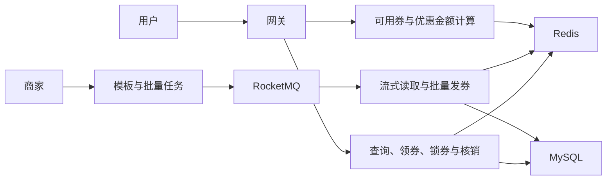

# 分布式优惠券系统：设计与故障演示

这是一个面向技术面试的**独立演示仓库**。它用原创架构说明和一个可运行的小模型，展示我对优惠券模板、批量分发、用户领券、订单结算及监控的设计理解。演示代码不是完整业务系统，也不是私有学习项目的源码副本。

## 3 分钟看什么

1. [系统架构](docs/architecture.md)：模块职责、两种发券路径和数据分片选择。
2. [高并发领券](docs/redeem.md)：Redis 预占、数据库提交、确认回滚与结果未知时的处理。
3. [监控与排障](docs/observability.md)：如何区分“请求已受理”和“券已到账”，以及该监控哪些业务不变量。



## 5 分钟复现一次失败与补偿

只需 Python 3，无需启动原系统。演示服务使用内存模拟缓存预占和数据库最终写入，**不能代表真实 Redis、MySQL 或 RocketMQ 的性能与故障行为**。

```sh
python3 -m unittest discover -s demo -p 'test_*.py'
python3 demo/server.py
```

在另一个终端执行：

```sh
curl -s -X POST http://localhost:8080/redeem -H 'Content-Type: application/json' -d '{"user_id":"alice","fail_db":true}'
curl -s http://localhost:8080/state
curl -s -X POST http://localhost:8080/redeem -H 'Content-Type: application/json' -d '{"user_id":"alice"}'
curl -s http://localhost:8080/state
curl -s http://localhost:8080/metrics
```

预期第一笔是 `rolled_back`，同一用户随后可以成功领取；库存守恒差额始终为零。使用 Docker 时可直接运行 `docker compose up`，随后访问 [Grafana](http://localhost:3000) 查看面板（本地演示账号 `admin/admin`）和 [Prometheus](http://localhost:9090)。端口与账号仅用于本机演示，不要向互联网暴露。

## 展示边界

- 私有项目的学习价值在于设计取舍与故障分析。本仓库不包含其源码、原图、配置或生产数据。
- 演示模型只验证小范围的状态转移和指标定义；它不证明多节点一致性、消息可靠投递或生产吞吐。
- 性能数字应包含机器、数据规模、持续时间、成功口径、P95/P99、错误和未发出的请求。只有 HTTP 受理耗时不能代表异步发券到账耗时。

## 面试时可以现场回答

**Redis 已预扣，但数据库失败了怎么办？** 确认回滚后释放本次预占；若提交结果未知，先保留凭据并对账，避免已经发券却归还库存。

**为什么批量发券要记录进度？** 文件很大，任务中断后需要恢复处理；进度、消息与数据库提交可能分离，因此仍需唯一约束、失败记录和最终对账。

**怎样判断系统真的正确？** 除延迟和吞吐外，观察库存、已发券数量、重复领取拦截、预占补偿和对账差额。
