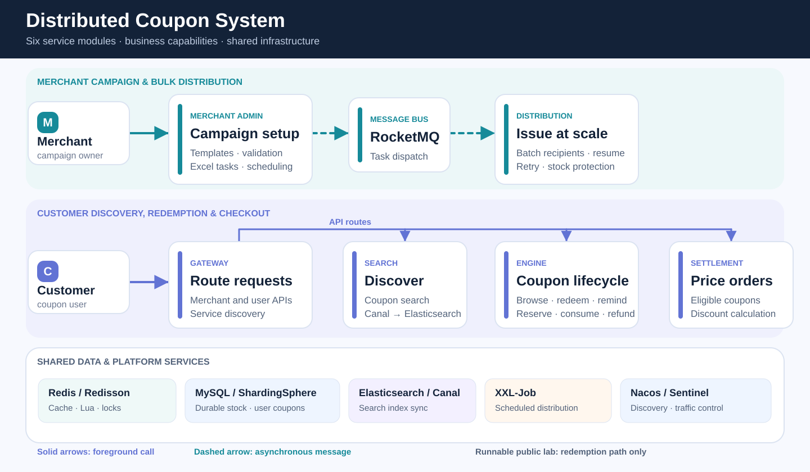
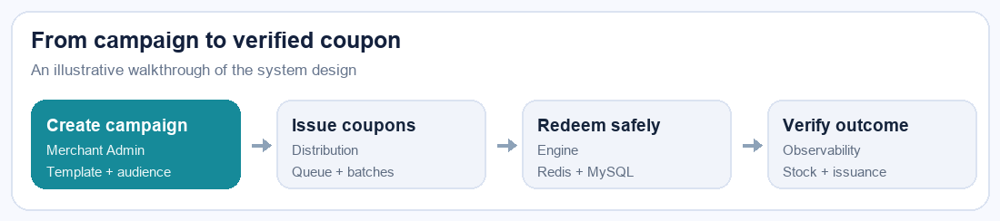

# Distributed Coupon System: Architecture, Failure Lab, and Observability

An independent, interview-ready study of a distributed coupon platform. The diagrams explain the larger system; the runnable lab isolates its hardest interactive path: **two redemption instances sharing Redis and MySQL**. It does not contain source code from the private learning project, and the lab is not a complete coupon platform.

## System at a glance

The four-step animation below follows campaign setup, bulk issuance, safe redemption, and outcome verification. It is an illustrative workflow, not a recording of the runnable lab.

The diagram is the **target-system design**, based on the project analysis. The runnable lab implements only the redemption slice with Redis, MySQL, two HTTP instances, Prometheus, and Grafana. Bulk distribution, RocketMQ, scheduled reminders, sharding, and checkout are explained as design cases rather than presented as running features.

## Start with the evidence

| Design focus | Where to look | What you can verify |
| --- | --- | --- |
| Module responsibilities | [Architecture map](docs/architecture.md) | Ownership of templates, bulk tasks, redemption, reminders, and checkout |
| Cross-instance stock safety | [Redemption design](docs/redeem.md), [Lua reservation](demo/reserve.lua), [database schema](demo/init.sql) | Redis fast rejection plus a conditional database stock update and a unique issued-coupon record |
| Failure recovery | [Failure experiment](docs/experiment.md) | Compensation only after confirmed rollback; the same request resolves across instances after a committed but uncertain response |
| Operational visibility | [Observability](docs/observability.md), [dashboard](monitoring/dashboard.json) | Outcome rates, stock, issuance, latency, and reconciliation gaps |

## Run the two-instance experiment

Requirements: Docker Compose and Python 3. Use a fresh Compose volume for the deterministic verification script.

~~~sh
docker compose up -d --build
python3 demo/verify.py
~~~

The script exercises rollback and retry, an uncertain response after commit, duplicate-user rejection, and 50 concurrent requests split between both instances. It expects **18 issued and 32 sold-out** from the concurrent phase, following two earlier successful issuances. The final state must be 20 issued, zero stock in both stores, and zero reconciliation gaps. See the [scenario-by-scenario walkthrough](docs/experiment.md).

Open [Grafana](http://127.0.0.1:3000) (admin / admin) for the **Coupon Redemption: Two Instances** dashboard, or [Prometheus](http://127.0.0.1:9090). Instance A listens on 127.0.0.1:8080; instance B on 127.0.0.1:28081. The demo credentials and ports are local-only. To repeat from a clean database and Redis state:

~~~sh
docker compose down -v
docker compose up -d --build
python3 demo/verify.py
~~~

This repository makes **no throughput claim**. A credible benchmark would publish machine specifications, workload and data shape, warm-up, test duration, offered and completed request rates, P95/P99, error counts, and the final inventory reconciliation result.
