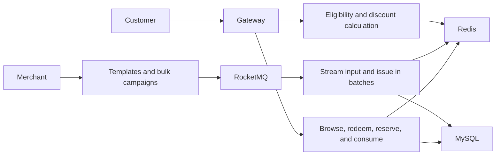

# Distributed Coupon System: Architecture and Failure Demo

This is an **independent interview portfolio project**. Original diagrams, design notes, and a small runnable model show how I reason about coupon templates, bulk distribution, high-concurrency redemption, checkout, and observability. The demo is not a complete coupon platform or a copy of the private learning project's source code.

## Three-minute tour

1. [Architecture](docs/architecture.md): service boundaries, two distribution paths, and sharding choices.
2. [Redemption design](docs/redeem.md): cache reservation, database commit, confirmed rollback, and uncertain outcomes.
3. [Observability](docs/observability.md): accepted requests versus delivered coupons, business invariants, and a failure demo.



## Reproduce a failed reservation in five minutes

Only Python 3 is required. The demo models a cache reservation and a final database write **in memory**. It does not reproduce real Redis, MySQL, or RocketMQ performance or failure behavior.

```sh
python3 -m unittest discover -s demo -p 'test_*.py'
python3 demo/server.py
```

In another terminal:

```sh
curl -s -X POST http://localhost:8080/redeem -H 'Content-Type: application/json' -d '{"user_id":"alice","fail_db":true}'
curl -s http://localhost:8080/state
curl -s -X POST http://localhost:8080/redeem -H 'Content-Type: application/json' -d '{"user_id":"alice"}'
curl -s http://localhost:8080/state
curl -s http://localhost:8080/metrics
```

The first request returns `rolled_back`. The same user can then redeem successfully, while the inventory conservation gap remains zero. To view the dashboard, run `docker compose up` instead of starting Python directly, then open [Grafana](http://localhost:3000) (local demo login: `admin/admin`) or [Prometheus](http://localhost:9090). These credentials and ports are for a loopback-only demo; do not expose them to the internet.

## What this project demonstrates

- The value of the private project lies in its design decisions and failure analysis. This repository contains none of its source files, images, configuration, or production data.
- The model checks a narrow set of state transitions and metric definitions. It does not establish multi-node consistency, reliable message delivery, or production throughput.
- Any performance claim needs the machine, dataset, test duration, success criteria, P95/P99, errors, and dropped requests. Fast HTTP acceptance alone does not establish fast asynchronous delivery.

## Questions I can answer in an interview

**Redis reserved stock, but the database write failed. What happens?** Release the reservation after a confirmed rollback. If the commit outcome is unknown, retain the reservation evidence and reconcile before releasing it.

**Why track progress during bulk distribution?** A large input may be interrupted. A saved row number helps resume work, while uniqueness constraints, failure records, and reconciliation handle gaps between progress, messages, and committed coupons.

**How do we know the system is correct?** Monitor inventory, issued coupons, duplicate attempts, reservation compensation, and reconciliation gaps alongside latency and throughput.
