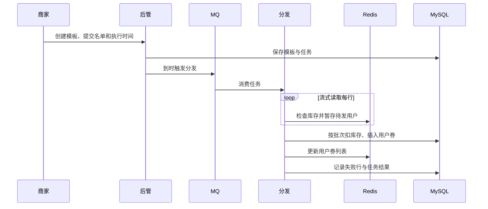

# 系统架构与设计取舍

## 核心对象

| 对象 | 职责 | 关键约束 |
| --- | --- | --- |
| 优惠券模板 | 定义商家、规则、发行库存和活动时间 | 库存不得为负，商家只能管理自己的模板 |
| 用户优惠券 | 记录用户实际持有的券及状态 | 不能违反每人领取上限，同一张券不能被两个订单消费 |
| 分发任务 | 记录名单、执行时间、进度及失败行 | 重试不能重复发券，任务完成需与到账结果核对 |
| 结算记录 | 关联用户券、订单和支付状态 | 锁定、核销、退款均需验证合法状态转换 |

## 六类服务如何协作

后管负责模板和批量任务；分发负责读取名单并批量发券；引擎负责用户查询、领券、提醒与券状态变更；结算负责订单选券和金额计算；搜索负责活动检索；网关是外部入口。RocketMQ 把耗时的发券和提醒与前台请求解耦，Redis 承担热点读和快速校验，MySQL 持久化最终发放记录。

## 两条领券路径

**批量分发**由商家任务驱动，目标是总吞吐和可恢复性。文件应逐行读取，按批次写入，重复消费由业务唯一约束与幂等处理兜底。只保存“处理到第几行”不等于该行已经到账；重启后要结合任务状态和已发券记录核对。

**用户主动领取**由用户请求驱动，目标是快速拒绝售罄与超限请求。Redis Lua 在缓存侧完成检查与预占，数据库事务进行条件扣库存和插入用户券。两个存储之间没有天然的原子提交，因此必须处理失败补偿与未知结果。详见[领券设计](redeem.md)。

## 数据分片为什么这样选

模板主要由商家创建和管理，按 `shop_number` 路由有利于商家维度操作；用户券主要按用户查询和结算，按 `user_id` 路由有利于用户维度访问。两类数据的分片键不同，跨商家或跨用户的查询需要拆分或汇总。分库分表分散存储与普通读写压力，但单个热门模板的库存记录仍会成为并发热点。

## 结算与使用

结算服务从用户券集合读取候选券，用 Redis Pipeline 批量查询模板，再按订单金额、商品范围和优惠规则计算可用券。Pipeline 主要减少往返等待。计算结果只是预览；用户提交订单时，还需在引擎中锁券，支付成功后核销，取消或退款时按业务规则处理状态。相同支付通知或退款通知可能重复到达，状态转换应具备幂等性。

## 面试官常问的边界

- **布隆过滤器能否证明模板存在？** 只能快速判定“肯定不存在”或“可能存在”；仍需要缓存或数据库确认。
- **用了 MQ 就能保证恰好一次吗？** 消息可能重复或延迟；最终发券仍依赖业务键、数据库约束和对账。
- **换成红锁能解决超卖吗？** 锁不代替数据库条件扣减。先说明当前故障模型与部署拓扑，再决定是否需要额外锁机制。
