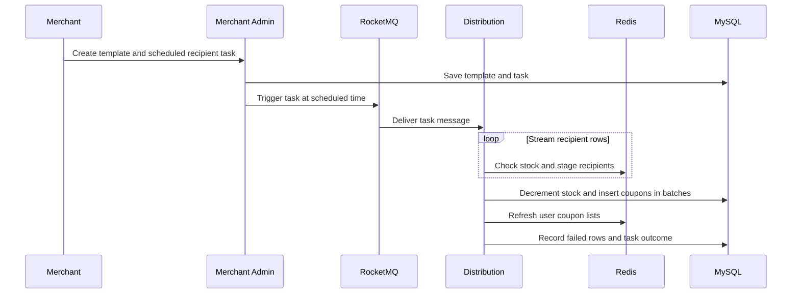

# Architecture and Design Trade-offs

## Domain objects

| Object | Purpose | Critical constraint |
| --- | --- | --- |
| Coupon template | Defines merchant, rules, issuance stock, and campaign window | Stock cannot go below zero; merchants may manage only their own templates |
| User coupon | Represents a coupon actually held by a user | Per-user limits apply; one coupon cannot pay for two orders |
| Distribution task | Tracks the audience, schedule, progress, and failed rows | Retrying must not issue duplicates; completion must be reconciled with delivery |
| Settlement record | Connects a user coupon to an order and payment state | Reserve, consume, and refund require valid state transitions |

## Service boundaries

Merchant Admin owns templates and bulk tasks. Distribution reads recipient lists and issues coupons in batches. Engine handles customer lookup, redemption, reminders, and coupon state changes. Settlement computes eligible coupons and discounts. Search supports campaign discovery, and Gateway is the external entry point. RocketMQ decouples time-consuming distribution and reminders from foreground requests; Redis serves hot reads and fast checks; MySQL persists the final issuance records.

## Two ways to issue coupons

**Bulk distribution** begins with a merchant task. Throughput and recoverability matter most: stream the input, write bounded batches, and use a business uniqueness constraint plus idempotent handling when messages are retried. “Processed through row N” does not prove every preceding coupon was delivered; compare task state with committed issuance records after a restart.

**Customer redemption** begins with an interactive request. Redis Lua can reject sold-out or over-limit attempts quickly and reserve capacity. A database transaction conditionally decrements durable stock and inserts a user coupon. The two stores do not share an atomic commit, so confirmed failures need compensation and uncertain outcomes need reconciliation. See [redemption design](redeem.md).

## Why the sharding keys differ

Template management is usually merchant-scoped, so routing templates by `shop_number` supports merchant operations. Coupon lookup and checkout are usually user-scoped, so routing user coupons by `user_id` supports those reads. Queries across merchants or users require routing to multiple shards and merging results. Sharding spreads storage and ordinary traffic, but one popular template's stock row can still become a write hotspot.

## Checkout and coupon usage

Settlement reads candidate user coupons and uses Redis Pipeline to fetch template details in batches. It checks order amount, eligible products, and discount rules. Pipelining mainly reduces network round trips. This calculation is a preview; order submission must reserve the selected coupon, payment success consumes it, and cancellation or refund follows the applicable state transition. Repeated payment or refund notifications must not repeat their effects.

## Boundaries worth discussing

- **Can a Bloom filter prove that a template exists?** It can reject a definite non-member, but a positive result still needs confirmation from cache or database.
- **Does a message queue guarantee exactly-once issuance?** Messages can be delayed or repeated. Business keys, database constraints, and reconciliation protect the final result.
- **Would Redlock prevent overselling?** A lock does not replace a conditional database stock update. Start with the actual failure model and deployment topology before adding another locking mechanism.
