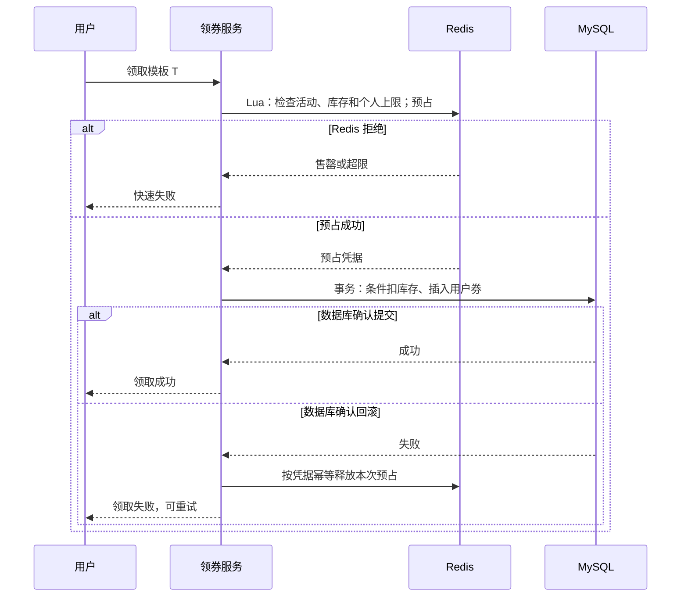

# 高并发领券：从快速失败到最终发放

## 正常路径

## 为什么数据库还要再次校验库存

Redis 负责挡住大量无效请求，但缓存可能滞后、丢失或因故障与数据库不一致。数据库的条件更新是持久化库存的最后一道约束：只有剩余库存足够才扣减。库存扣减和用户券插入应在同一数据库事务中，防止只扣库存或只发券。

## 失败分三类

| 情况 | Redis 预占 | 数据库写入 | 处理 |
| --- | --- | --- | --- |
| 正常成功 | 保留 | 确认提交 | 返回成功 |
| 确认回滚 | 已占用 | 确认未提交 | 使用唯一凭据幂等释放 |
| 结果未知 | 已占用 | 可能提交 | 保留凭据，查询最终记录并对账 |

未知结果不能简单地“碰到异常就加回库存”。例如数据库提交后网络超时，调用方看到异常，但用户券实际上已经存在。直接归还 Redis 预占可能再次放行一个用户。

## 需要守住的不变量

- 已发券数量不能超过初始库存。
- 同一用户的成功领取数不能超过个人上限。
- 对一个确定失败的请求，释放操作重复执行也不能多归还库存。
- 对账完成后：初始数据库库存 = 已发用户券数 + 当前数据库库存。

仓库中的[独立演示](../demo/server.py)只展示这些状态变化。它用一个进程内锁模拟原子预占，刻意没有模拟分布式事务、进程崩溃、MQ 重复投递或 Redis 主从切换；这些需要在真实系统里分别验证。
